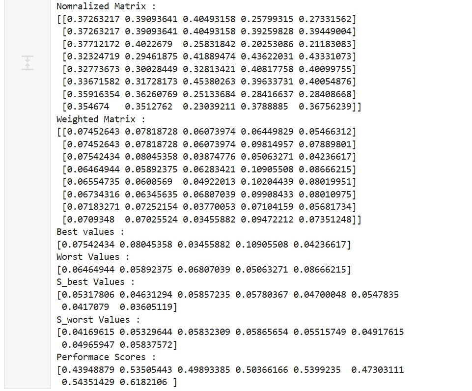
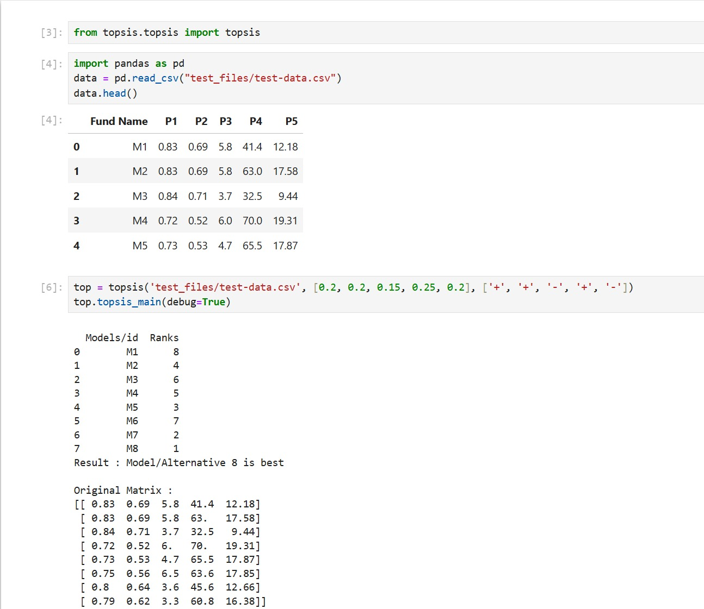
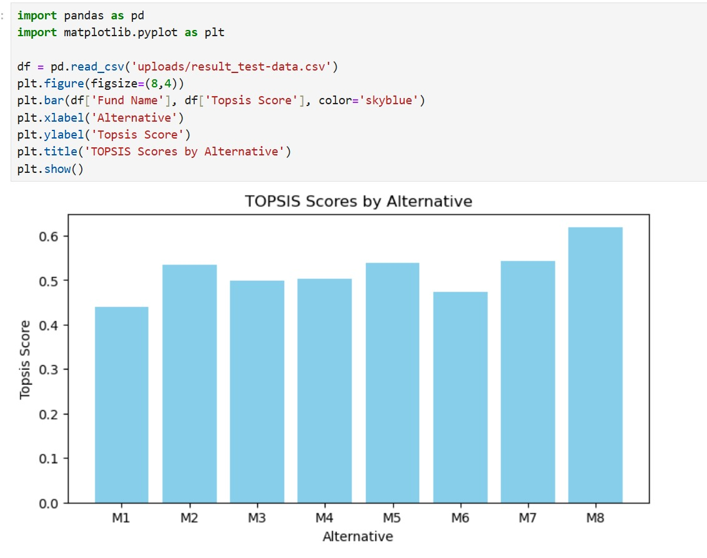

# Topsis-SURYA-102303737

TOPSIS (Technique for Order Preference by Similarity to Ideal Solution) command-line package by **SURYA KANT TIWARI** (Roll 102303737).

**Repository**: https://github.com/SuryaKTiwari11/TOPSIS

## Images

### Weighted Matrix



### Code Example



## Installation

### From PyPI (after publishing)

```bash
pip install Topsis-SURYA-102303737
```

### Local development

```bash
git clone https://github.com/SuryaKTiwari11/TOPSIS.git
cd TOPSIS
pip install -e .
```

## Usage

### Command-line interface

```bash
python -m topsis_surya <InputDataFile> <Weights> <Impacts> <OutputResultFile>
```

Or after installation:

```bash
topsis-cli data.csv "1,1,1,2" "+,+,-,+" output.csv
```

### Parameters

- **InputDataFile**: CSV file with first column as identifier, remaining columns as numeric criteria
- **Weights**: Comma-separated numeric values (e.g., `1,1,1,2`)
- **Impacts**: Comma-separated `+` (beneficial) or `-` (cost) for each criterion (e.g., `+,+,-,+`)
- **OutputResultFile**: Path for result CSV with added `Topsis Score` and `Rank` columns

### Example

```bash
topsis-cli input.csv "1,1,1,1" "+,+,-,+" result.csv
```

## Methodology

### TOPSIS Algorithm Steps

This project implements the TOPSIS (Technique for Order Preference by Similarity to Ideal Solution) method for multi-criteria decision making. The methodology is as follows:

1. **Normalization**: The decision matrix is normalized using vector normalization so that all criteria are dimensionless and comparable.
   - Formula: $r_{ij} = \frac{x_{ij}}{\sqrt{\sum x_{ij}^2}}$
2. **Weighting**: Each normalized criterion is multiplied by its assigned weight to reflect its importance.
   - Formula: $v_{ij} = w_j \times r_{ij}$
3. **Ideal Best & Worst**: For each criterion, determine the ideal best (maximum for beneficial, minimum for cost) and ideal worst (opposite).
   - Beneficial (+): best = max, worst = min
   - Cost (-): best = min, worst = max
4. **Separation Measures**: Calculate the Euclidean distance of each alternative from the ideal best and worst.
   - $S_i^+ = \sqrt{\sum (v_{ij} - v_j^+)^2}$
   - $S_i^- = \sqrt{\sum (v_{ij} - v_j^-)^2}$
5. **TOPSIS Score**: Compute the relative closeness to the ideal solution.
   - $C_i = \frac{S_i^-}{S_i^+ + S_i^-}$
6. **Ranking**: Alternatives are ranked based on their TOPSIS scores (higher is better).

All these steps are implemented efficiently using NumPy and Pandas in [topsis_surya/core.py](topsis_surya/core.py).

## Example Result Table

After running TOPSIS, the output CSV will look like this (see [output.csv](output.csv)):

| Fund Name | P1   | P2   | P3  | P4   | P5    | Topsis Score | Rank |
| --------- | ---- | ---- | --- | ---- | ----- | ------------ | ---- |
| M1        | 0.67 | 0.45 | 6.5 | 42.6 | 12.56 | 0.215        | 8    |
| M2        | 0.60 | 0.36 | 3.6 | 53.3 | 14.47 | 0.468        | 4    |
| M3        | 0.82 | 0.67 | 3.8 | 63.1 | 17.10 | 0.861        | 1    |
| M4        | 0.60 | 0.36 | 3.5 | 69.2 | 18.42 | 0.589        | 3    |
| M5        | 0.76 | 0.58 | 4.8 | 43.0 | 12.29 | 0.451        | 5    |
| M6        | 0.69 | 0.48 | 6.6 | 48.7 | 14.12 | 0.327        | 7    |
| M7        | 0.79 | 0.62 | 4.8 | 59.2 | 16.35 | 0.695        | 2    |
| M8        | 0.84 | 0.71 | 6.5 | 34.5 | 10.64 | 0.414        | 6    |

Where:

- **Topsis Score**: The relative closeness to the ideal solution (0 to 1)
- **Rank**: 1 is best

## Example Input Table

The input data (see [test-data.csv](test-data.csv)) should look like:

| Fund Name | P1   | P2   | P3  | P4   | P5    |
| --------- | ---- | ---- | --- | ---- | ----- |
| M1        | 0.83 | 0.69 | 5.8 | 41.4 | 12.18 |
| M2        | 0.83 | 0.69 | 5.8 | 63.0 | 17.58 |
| M3        | 0.84 | 0.71 | 3.7 | 32.5 | 9.44  |
| M4        | 0.72 | 0.52 | 6.0 | 70.0 | 19.31 |
| M5        | 0.73 | 0.53 | 4.7 | 65.5 | 17.87 |
| M6        | 0.75 | 0.56 | 6.5 | 63.6 | 17.85 |
| M7        | 0.80 | 0.64 | 3.6 | 45.6 | 12.66 |
| M8        | 0.79 | 0.62 | 3.3 | 60.8 | 16.38 |

## Result Graph

You can visualize the results using a bar plot of TOPSIS scores or ranks. Here is an example using matplotlib:

```python
import pandas as pd
import matplotlib.pyplot as plt

df = pd.read_csv('output.csv')
plt.figure(figsize=(8,4))
plt.bar(df['Fund Name'], df['Topsis Score'], color='skyblue')
plt.xlabel('Alternative')
plt.ylabel('Topsis Score')
plt.title('TOPSIS Scores by Alternative')
plt.show()
```

This will produce a graph showing the relative performance of each alternative. You can also plot the ranks for a clearer comparison.



## Input Format

CSV file with:

- Header row
- First column: Alternative names/IDs
- Remaining columns: Numeric criteria values (minimum 2 criteria required)

## Output Format

Input data with two additional columns:

- **Topsis Score**: Closeness coefficient (0-1)
- **Rank**: Rank based on score (1 = best)

## Publishing to PyPI

### Build

```bash
python -m build
```

### Upload

```bash
python -m twine upload dist/*
```

### Test installation

```bash
pip install Topsis-SURYA-102303737
topsis-cli --help
```

## License

MIT License - see [LICENSE](LICENSE) file

## Author

SURYA KANT TIWARI - Roll No. 102303737
